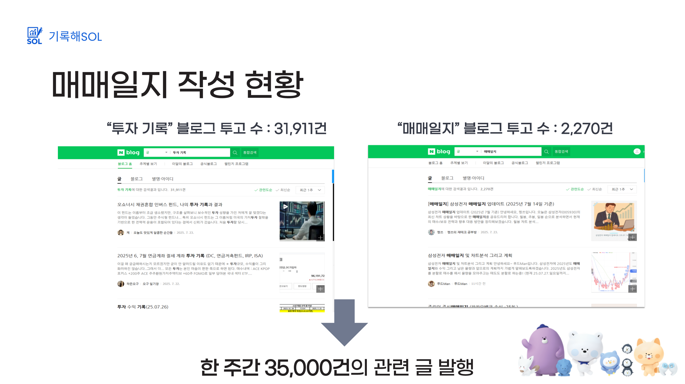
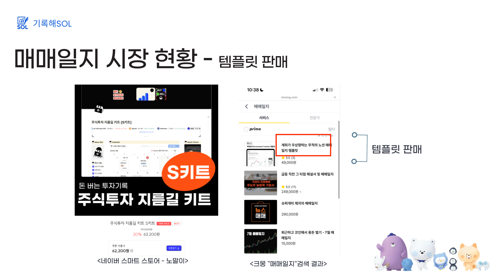
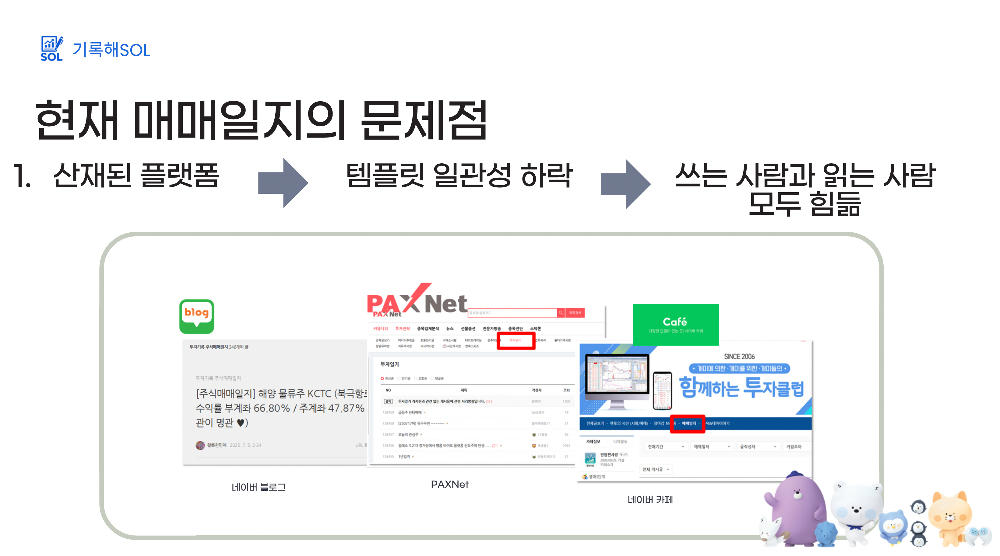
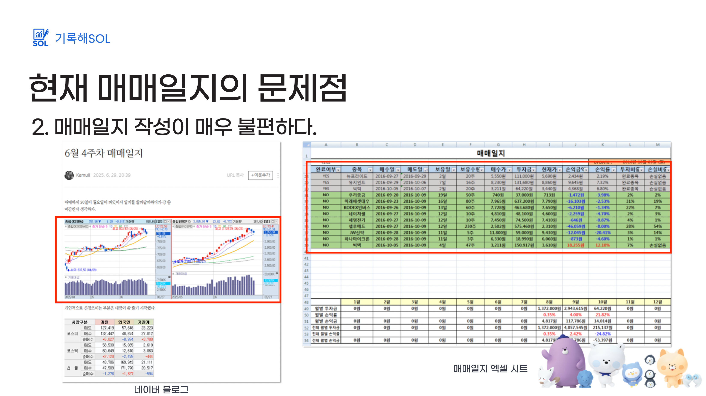
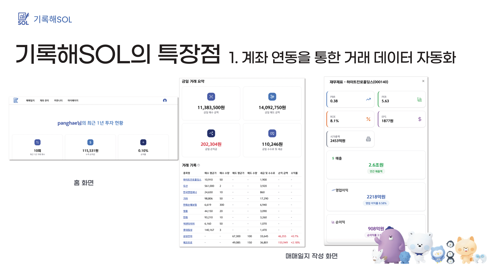
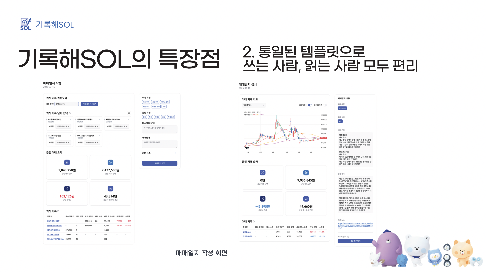
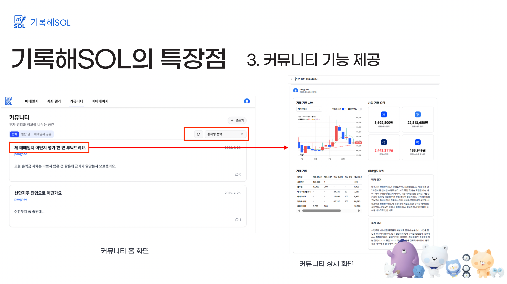
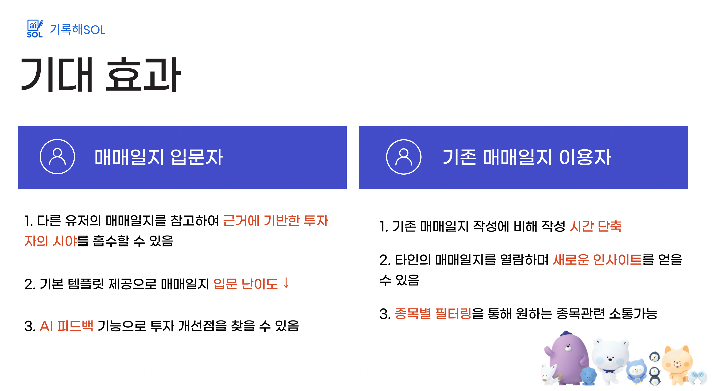
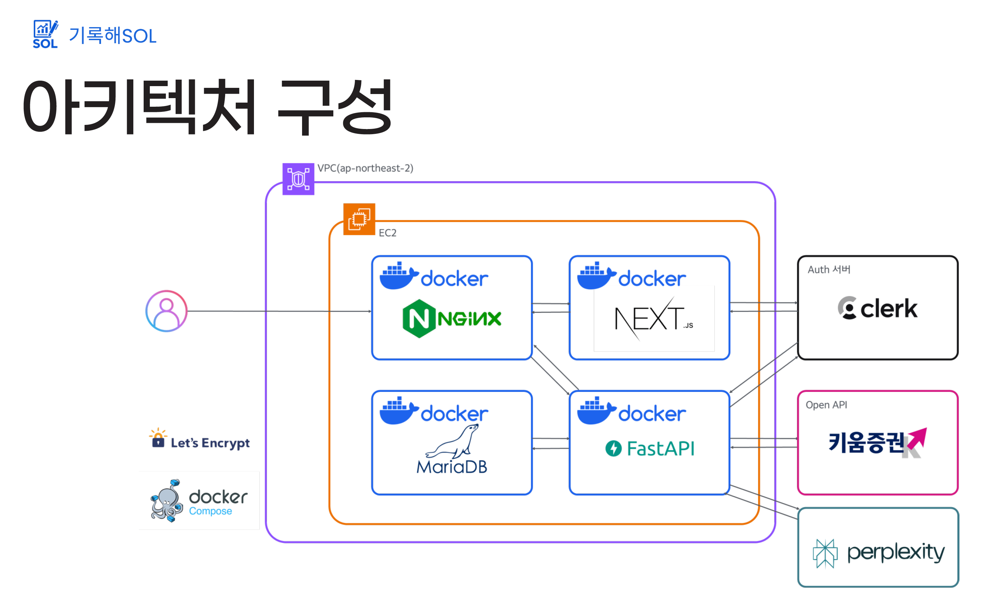
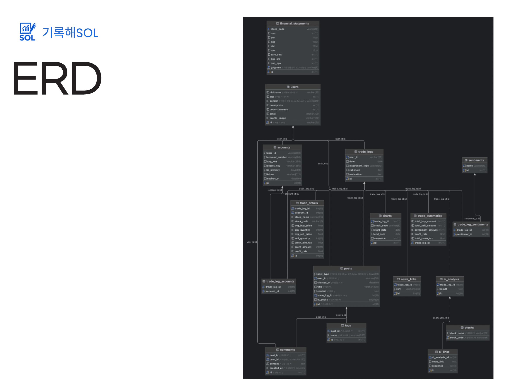

# 기록해SOL

🕹 간편한 기록의 시작, 원클릭 매매일지

### Team Member

|                                                    이광해                                                     |                                                    김혜윤                                                     |                                                     박순영                                                     |                                                    한정우                                                     |
| :-----------------------------------------------------------------------------------------------------------: | :-----------------------------------------------------------------------------------------------------------: | :------------------------------------------------------------------------------------------------------------: | :-----------------------------------------------------------------------------------------------------------: |
|                                             PM, Full-Stack, Infra                                             |                                                  Full-Stack                                                   |                                                   Full-Stack                                                   |                                                  Full-Stack                                                   |
|  |  |  |  |
|                                     [Panghae](https://github.com/Panghae)                                     |                                   [gpdbs9409](https://github.com/gpdbs9409)                                   |                                   [ruluralaa](https://github.com/ruluralaa)                                    |                                    [hanuuuuU](https://github.com/hanuuuuU)                                    |

### 개발 기간

2025.07.03 - 2025.07.29

### 활용 기술 및 도구

- **Frontend**: Next.js, React, TypeScript, TailwindCss, Shadcn
- **Backend**: FastAPI, Python, MariaDB, Clerk
- **Infra**: VPC, EC2, Doker, Nginx
- **Open API**: 키움증권 API
- **AI API**: Perplexity
- **Collaboration**: GitHub, Notion

 

## 시장 현황 및 문제 인식

## 특장점

### 1. 계좌연동을 통한 거래 데이터 자동화

### 2. 통일된 템플릿으로 쓰는 사람, 읽는 사람 모두 편리

### 3. 커뮤니티 기능 제공

## 기대효과

## 아키텍쳐 구성

## ERD

